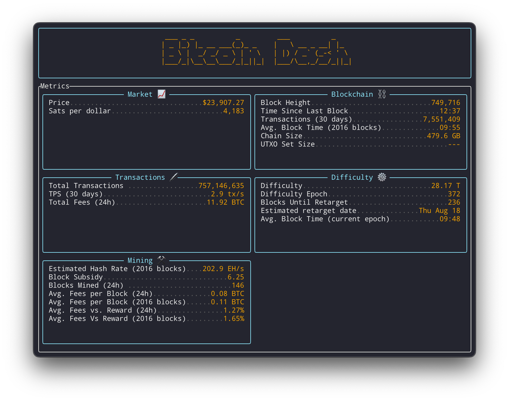

☠️⚠️ Work In Progress ⚠️☠️

# Bitcoin Terminal Dashboard
> Bitcoin Dashboard in the Terminal



This library provides helpful functions to query common information about the bitcoin network.

## Install
> Add package to Cargo.toml file
```rust
[dependencies]
bitcoin-node-query = "0.1.2"
```

## Usage:
```
 BITCOIND_PASSWORD=<node_password>BITCOIND_USERNAME=<node_username> BITCOIND_URL=<node_url> cargo run
```

## Related
- [bitcoind-request](https://github.com/joegesualdo/bitcoind-request) - Type-safe wrapper around bitcoind RPC commands
- [bitcoin-node-query](https://github.com/joegesualdo/bitcoin-node-query) - Query information about the bitcoin network

## License
MIT © [Joe Gesualdo]()

